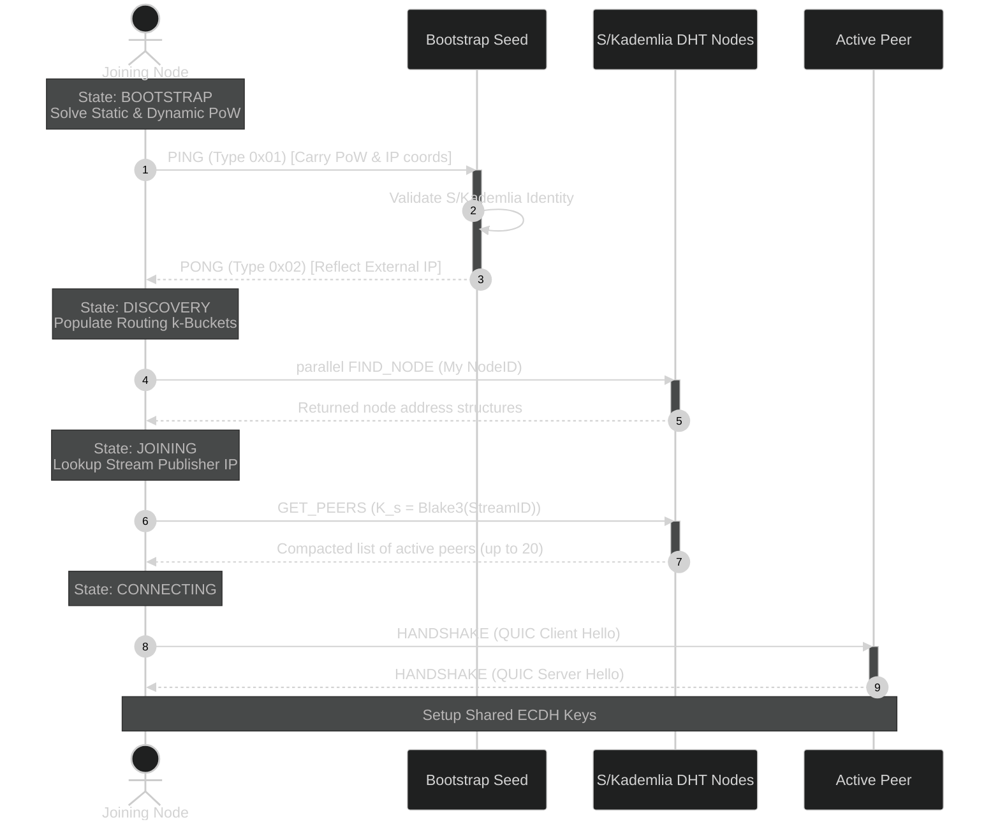
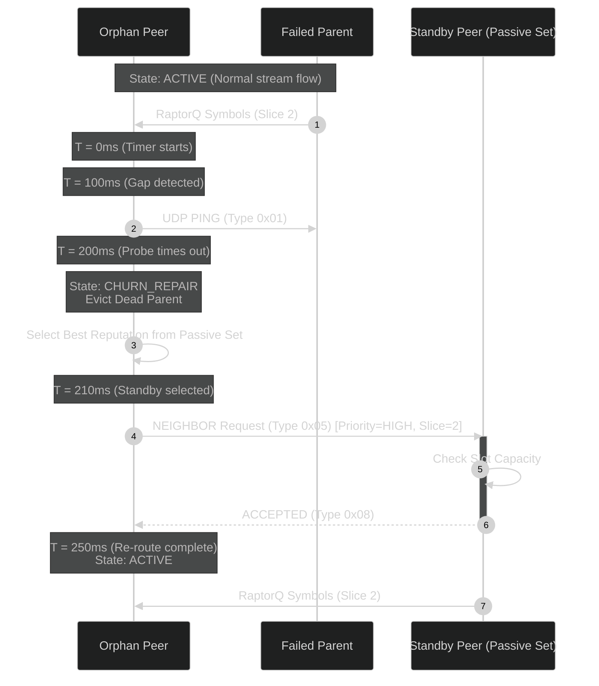
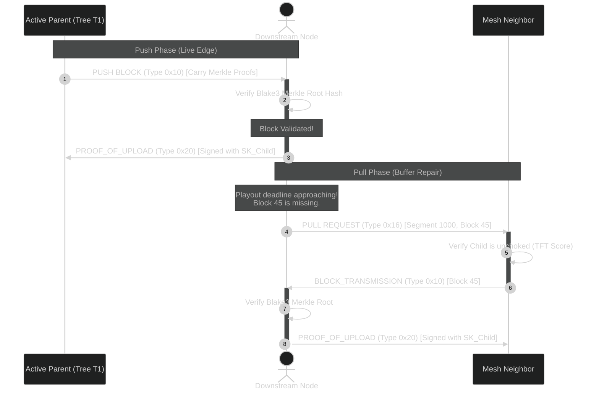
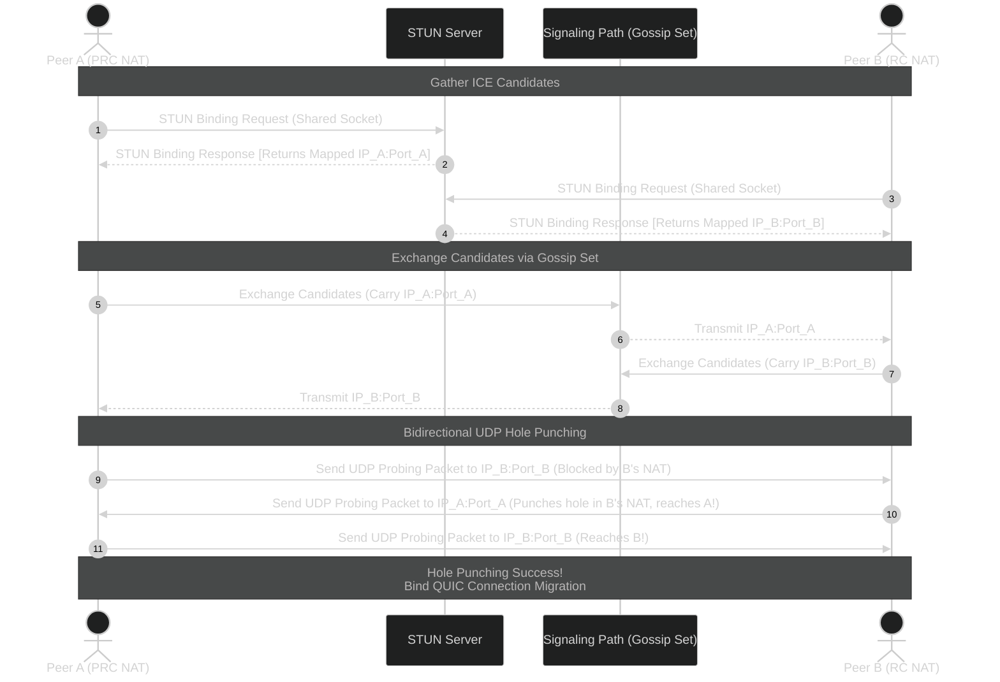

# Appendix A: Sequence Diagrams

This appendix provides formal Mermaid.js sequence diagrams detailing the asynchronous messaging patterns and coordination loops of the protocol.

---

## A.1 Node Bootstrap and S/Kademlia DHT Stream Join

This flow maps how a joining node validates its Proof-of-Work Node ID, queries seed nodes to populate its local routing table, and retrieves the active peer list for stream initiation.

---

## A.2 250ms Churn Recovery and Local Parent Re-Routing

This diagram demonstrates how a node detects a dead connection and promotes a candidate standby peer from its local Passive Set to resume data flow in less than $250\text{ ms}$.

---

## A.3 Media Push-Pull Buffer Synchronizer & PoU Receipt Exchange

This flow maps the data path: how high-priority edge chunks are pushed via multi-forest trees, how missed chunks are repaired via pulling, and how cryptographic Proof-of-Upload (PoU) receipts are exchanged to earn contribution score.

---

## A.4 STUN/ICE UDP Hole Punching Coordination

This diagram details the sequence where two NAT-restricted peers establish direct socket pathways using STUN candidate discovery and bidirectional hole punching.

