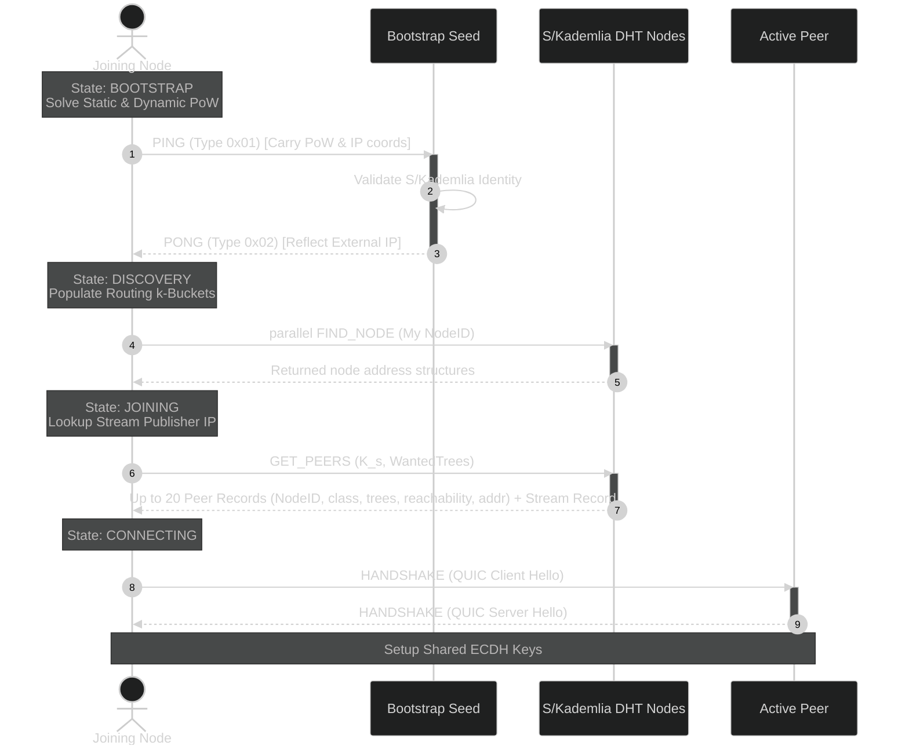
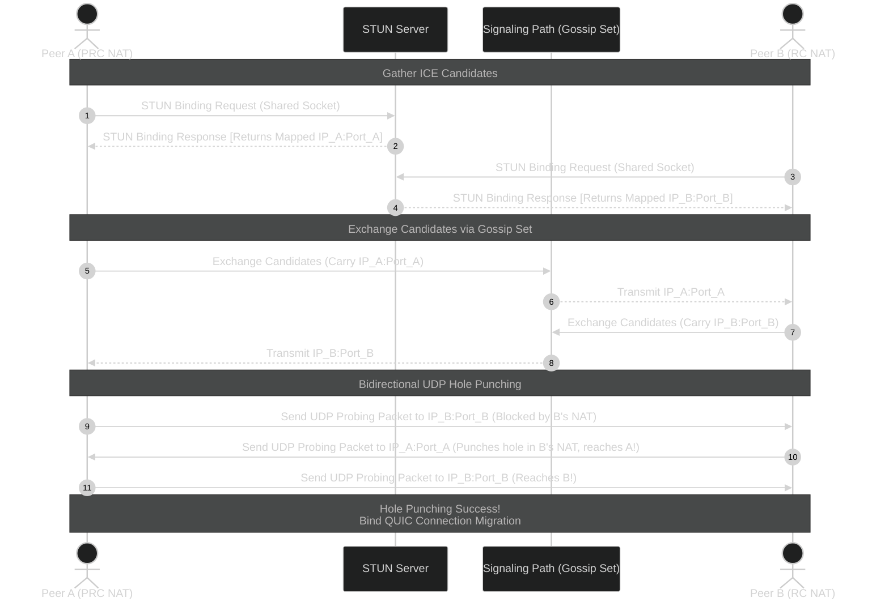

# Appendix A: Sequence Diagrams

This appendix provides formal Mermaid.js sequence diagrams detailing the asynchronous messaging patterns and coordination loops of the protocol.

---

## A.1 Node Bootstrap and S/Kademlia DHT Stream Join

This flow maps how a joining node validates its Proof-of-Work Node ID, queries seed nodes to populate its local routing table, and retrieves the active peer list for stream initiation.

```mermaid
%%{init: {'theme': 'dark'}}%%
sequenceDiagram
    autonumber
    actor User as Joining Node
    participant Seed as Bootstrap Seed
    participant DHT as S/Kademlia DHT Nodes
    participant Peer as Active Peer

    Note over User: State: BOOTSTRAP<br/>Solve Static & Dynamic PoW
    User->>Seed: PING (Type 0x01) [Carry PoW & IP coords]
    activate Seed
    Seed->>Seed: Validate S/Kademlia Identity
    Seed-->>User: PONG (Type 0x02) [Reflect External IP]
    deactivate Seed
    
    Note over User: State: DISCOVERY<br/>Populate Routing k-Buckets
    User->>DHT: parallel FIND_NODE (My NodeID)
    activate DHT
    DHT-->>User: Returned node address structures
    deactivate DHT

    Note over User: State: JOINING<br/>Lookup Stream Publisher IP
    User->>DHT: GET_PEERS (K_s, WantedTrees)
    activate DHT
    DHT-->>User: Up to 20 Peer Records (NodeID, class, trees, reachability, addr) + Stream Record
    deactivate DHT

    Note over User: State: CONNECTING
    User->>Peer: HANDSHAKE (QUIC Client Hello)
    activate Peer
    Peer-->>User: HANDSHAKE (QUIC Server Hello)
    deactivate Peer
    Note over User, Peer: Setup Shared ECDH Keys
```

---

## A.2 Sub-Second Churn Recovery and Local Parent Re-Routing

This diagram demonstrates how a node detects a dead parent in one tree and promotes a standby from that tree's candidate pool to resume data flow — about $250$–$300$ ms on a local path, RTT-scaled elsewhere (Ch3 §3.3) — while every other tree keeps streaming.

```mermaid
%%{init: {'theme': 'dark'}}%%
sequenceDiagram
    autonumber
    participant Child as Orphan Peer
    participant Dead as Failed Parent
    participant Active as Standby Peer (Passive Set)

    Note over Child, Dead: State: ACTIVE (Normal stream flow)
    Dead->>Child: RaptorQ Symbols (Slice 2)
    Note over Child: T = 0ms (Timer starts)
    Note over Child: T = 100ms (Gap detected)
    Child->>Dead: UDP PING (Type 0x01)
    Note over Child: T = τ_evict (probe times out; RTT-scaled, ≥ 200 ms)
    Note over Child: Tree 2 enters CHURN_REPAIR<br/>Other trees keep streaming; evict dead parent for tree 2
    Child->>Child: Select best relay of Slice 2 from per-tree pool P_2
    
    Note over Child: T = τ_evict + 10 ms (Standby selected)
    Child->>Active: NEIGHBOR Request (Type 0x05) [Priority=HIGH, Slice=2]
    activate Active
    Active->>Active: Check Slot Capacity
    Active-->>Child: ACCEPTED (Type 0x08)
    deactivate Active
    
    Note over Child: T = τ_evict + 50 ms (Re-route complete)<br/>Tree 2 back to streaming
    Active->>Child: RaptorQ Symbols (Slice 2)
```

---

## A.3 Media Push-Pull Buffer Synchronizer & PoU Receipt Exchange

This flow maps the data path: how high-priority edge chunks are pushed via multi-forest trees, how missed chunks are repaired via pulling, and how cryptographic Proof-of-Upload (PoU) receipts are exchanged to earn contribution score.

```mermaid
%%{init: {'theme': 'dark'}}%%
sequenceDiagram
    autonumber
    participant Parent as Active Parent (Tree T1)
    actor Child as Downstream Node
    participant Mesh as Mesh Neighbor

    Note over Parent, Child: Push Phase (Live Edge)
    Parent->>Child: BLOCK_PROOF (0x13) + RAPTORQ_SYMBOL (0x12) datagrams, per block
    activate Child
    Child->>Child: Verify each block against the chunk MANIFEST root
    Note over Child: Segment k complete in this tree
    Child->>Parent: PROOF_OF_UPLOAD (0x20) [segment k, tree m, block bitmap, loss rate; signed SK_Child]
    deactivate Child

    Note over Child, Mesh: Pull Phase (Buffer Repair)
    Note over Child: Playout deadline approaching!<br/>Block 45 is missing.
    Child->>Mesh: PULL REQUEST (Type 0x16) [Segment 1000, Block 45]
    activate Mesh
    Mesh->>Mesh: Verify Child is unchoked (TFT Score)
    Mesh->>Child: BLOCK_TRANSMISSION (Type 0x10) [Block 45]
    deactivate Mesh
    activate Child
    Child->>Child: Verify Blake3 Merkle Root
    Child->>Mesh: PROOF_OF_UPLOAD (0x20) at segment end [RxFlags.PULL, bitmap of pulled blocks]
    deactivate Child
```

---

## A.4 STUN/ICE UDP Hole Punching Coordination

This diagram details the sequence where two NAT-restricted peers establish direct socket pathways using STUN candidate discovery and bidirectional hole punching.

```mermaid
%%{init: {'theme': 'dark'}}%%
sequenceDiagram
    autonumber
    actor A as Peer A (PRC NAT)
    participant STUN as STUN Server
    participant Sign as Signaling Path (Gossip Set)
    actor B as Peer B (RC NAT)

    Note over A, B: Gather ICE Candidates
    A->>STUN: STUN Binding Request (Shared Socket)
    STUN-->>A: STUN Binding Response [Returns Mapped IP_A:Port_A]
    B->>STUN: STUN Binding Request (Shared Socket)
    STUN-->>B: STUN Binding Response [Returns Mapped IP_B:Port_B]

    Note over A, B: Exchange Candidates via Gossip Set
    A->>Sign: Exchange Candidates (Carry IP_A:Port_A)
    Sign-->>B: Transmit IP_A:Port_A
    B->>Sign: Exchange Candidates (Carry IP_B:Port_B)
    Sign-->>A: Transmit IP_B:Port_B

    Note over A, B: Bidirectional UDP Hole Punching
    A->>B: Send UDP Probing Packet to IP_B:Port_B (Blocked by B's NAT)
    B->>A: Send UDP Probing Packet to IP_A:Port_A (Punches hole in B's NAT, reaches A!)
    A->>B: Send UDP Probing Packet to IP_B:Port_B (Reaches B!)
    Note over A, B: Hole Punching Success!<br/>Bind QUIC Connection Migration
```
